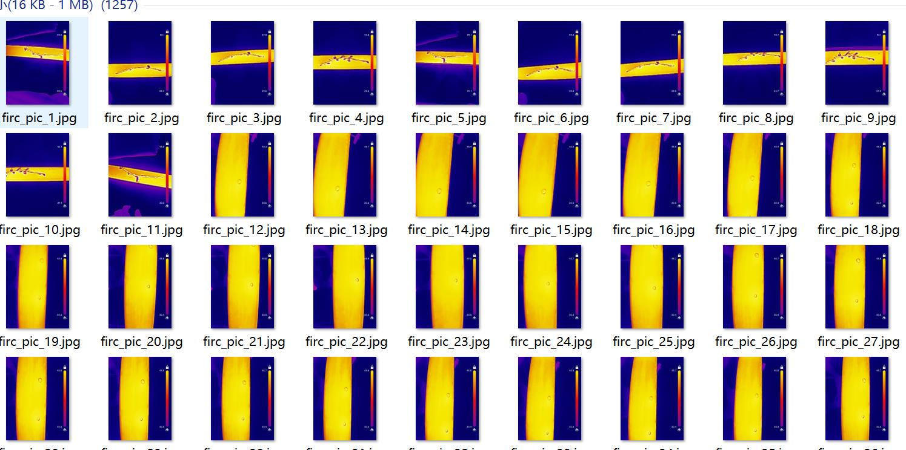
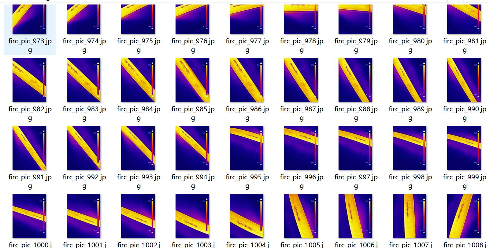
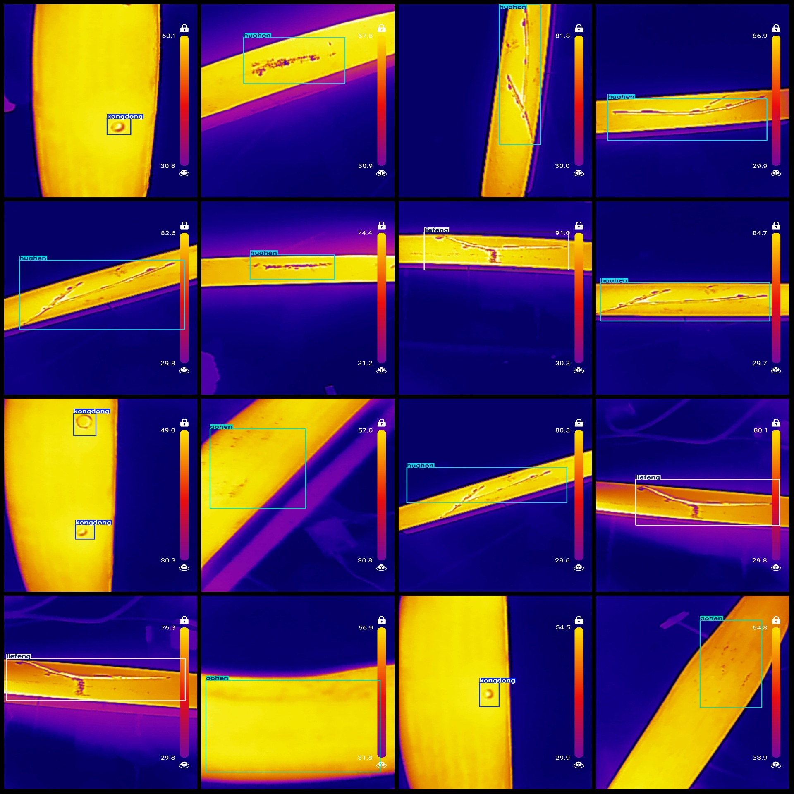
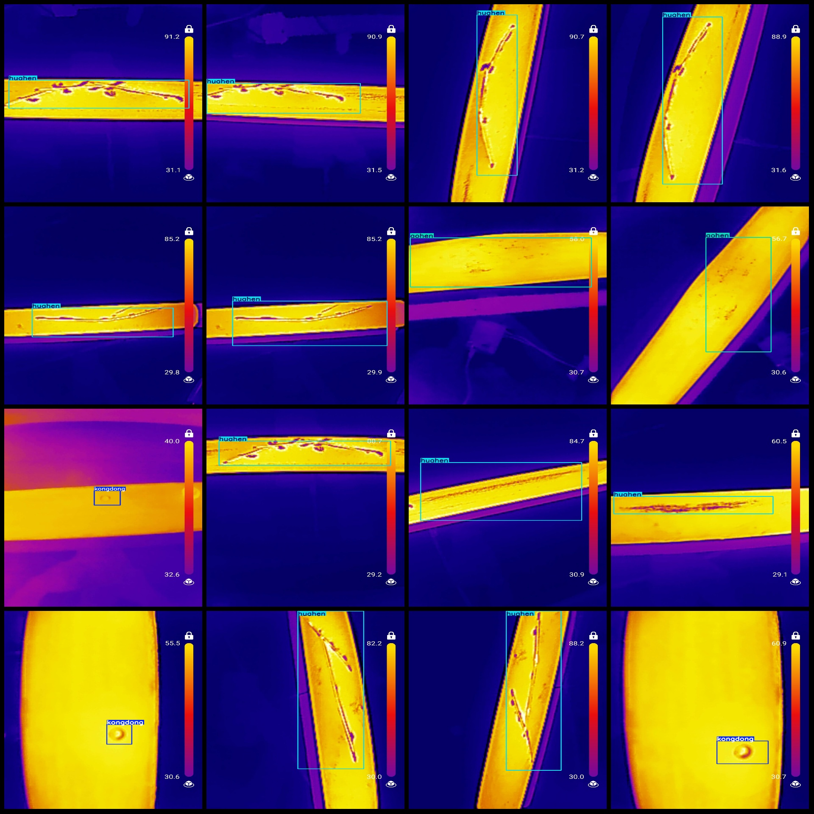

# Infrared Thermal Imaging Image Partial Surface Defect Detection Dataset (VOC+YOLO Format) - 1257 Images in 4 Categories

Dataset Format: Pascal VOC format + YOLO format (txt file without splitting path, only containing jpg images and corresponding VOC format xml files and YOLO format txt files).
Number of Images (jpg files): 1257
Number of Annotations (xml files): 1257
Number of Annotations (txt files): 1257
Number of Annotation Categories: 4
Annotation Category Names: ["aohen", "huahen", "kongdong", "liefeng"] (note that the YOLO format category order does not correspond to this, but is based on the labels folder 'classes.txt')
Corresponding Chinese Category Names: ["Aohe", "Huahen", "Kongdong", "Liefeng"]
Box Count per Category:
- Aohen Box Count = 219
- Huahen Box Count = 683
- Kongdong Box Count = 289
- Liefeng Box Count = 145
Total Box Count: 1336
Box Count per Image per Category:
- Aohen Occupies Images = 213
- Huahen Occupies Images = 676
- Kongdong Occupies Images = 224
- Liefeng Occupies Images = 144
Image Resolution: 1080x1440
Annotation Tool Used: labelImg
Annotation Rules: Draw a box around each category
Important Notice: The dataset does not have a division into training, validation, and testing sets; users are required to partition them themselves.
Special Remark: This dataset does not guarantee the accuracy of the trained models or weight files.
Image Preview:
Annotation Example:

## Image

Here is a pay link on Stripe ( https://buy.stripe.com/3cs8yP7sY87d0vu9AB ). Please contact me lonlonago@foxmail.com after funding $89, and I will send you a complete data files , thank you!

